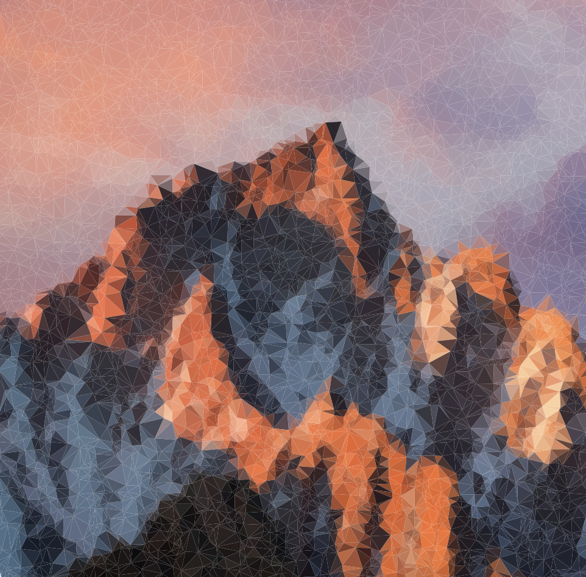
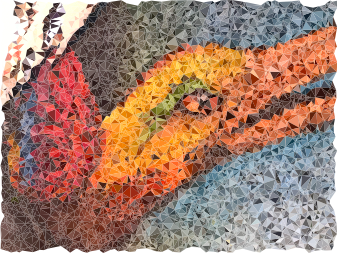
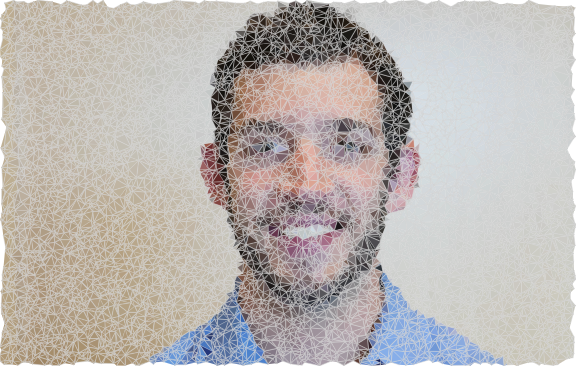

# Triangulate

This project uses a <a href="https://github.com/d3/d3/blob/master/API.md#voronoi-diagrams-d3-voronoi" target="_blank">Voronoi Diagram</a> to randomly sample points from an image to construct an abstracted representation of it. It was built based on <a href="https://bl.ocks.org/mbostock/4341156">this example</a> that expresses the Delaunay Triangulation used to compute a Voronoi Diagram. Simple controls allow you to specify the number of triangles, as well as blur the original photo. Blur effect is done with <a href="https://github.com/flozz/StackBlurStackBlur">this library</a>.

Some examples:

## Related work 
For a much more robust command line tool that creates triangulated images, see [this project](https://github.com/esimov/triangle).